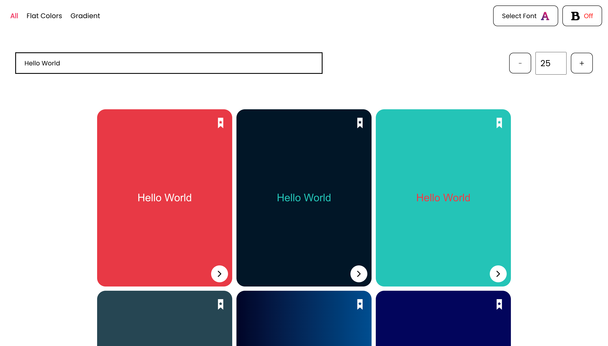

# FONT_KNIGA (React,Firebase and Redux)
[Link to website](https://font-kniga-890.web.app/)

<h1 align="center">Built With</h1>
<p align="center">
  <a href="https://firebase.google.com/" target="_blank"></a> 
  <a href="https://reactjs.org/" target="_blank">  </a> 
  <a href="https://redux.js.org" target="_blank">  </a> 
</p>

### What is this About ?
This website is made for all the frontend developers who have trouble in finding best colors and fonts for their website or a particular card.
In this website we can also create a custom color and font set and then save it in our Account or you can select from the pre made cards and modify them according to you and save.
<p align="center">
  </img>
</p>
Just clicking the button below the card will show you the code of the card.


## How to Contribute
* First fork the repo by clicking the fork button
* To Clone the repo run the command given below:
```sh 
git clone https://github.com/{your_user_name}/Font_KNIGA.git
```
* Go to the folder and install npm using this command
```sh
npm install
```
* Do your changes on a new branch
* Make a public request
* If changes are good I will merge it with the main branch


## Features
* Google Sign In using firebase
* Save your own custom creating cards or predesigned cards with your text,font style,size and bold
* Easy Interface

## Screenshots
<p align="center">
  
  
  
  
</p>

### Special thanks to:
<p>Coolors.com</p>
<p>uigradients.com</p>
<p>Google fonts</p>

###### Thanks for making this possible

[Link to Website](https://font-kniga-890.web.app/)
